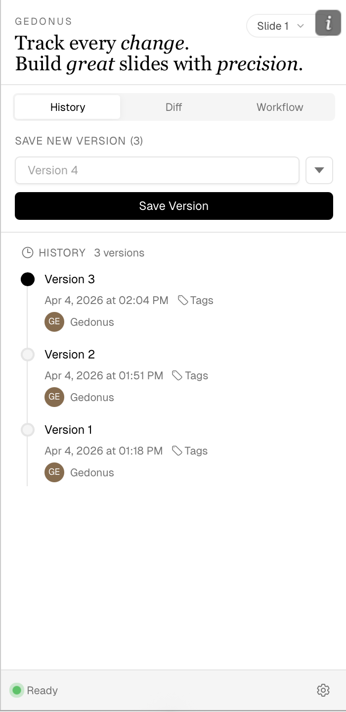

# Gedonus

Local-first version control for PowerPoint.

Gedonus is a PowerPoint task pane add-in that brings Git-style workflows to slide decks: save versions, compare slide changes, and restore snapshots quickly. Everything runs in the client by default.



## Why Gedonus

- Built for fast iteration in presentations, not generic file storage
- Version history is scoped per document
- Slide comparison highlights visual and content changes
- No backend required for core usage

## Current Product Status

Gedonus is early-stage and actively evolving. Core workflows are stable, while UX and advanced collaboration features are still being refined.

## Tech Stack

- Office JS API
- React + TypeScript (strict)
- Vite + Tailwind
- JSZip for PPTX processing
- OPFS (Origin Private File System) for local persistence

## Quick Start

```bash
npm install
npm start
```

This starts the local dev server and sideload flow for PowerPoint.

## Scripts

- `npm start` -> run add-in in debug/sideload mode
- `npm run build` -> production build
- `npm run lint` -> lint checks

## Vision

PowerPoint should have the same confidence and traceability that developers have in code workflows. Gedonus is building that layer for modern presentation teams.
